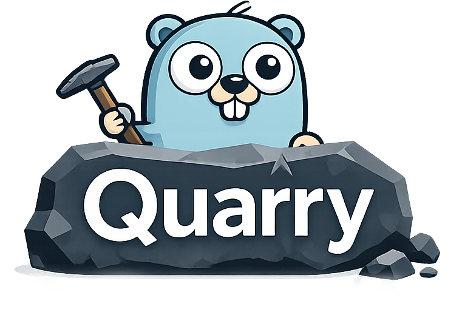

<p align="center">
  
</p>

<p align="center">
  <a href="https://github.com/sphireinc/quarry/actions/workflows/ci.yml">
    
  </a>
  <a href="LICENSE">
    
  </a>
  <a href="go.mod">
    
  </a>
  <a href="docs/index.html">
    
  </a>
</p>

# Quarry

Quarry is a SQL Composition Kit for Go.

> Write SQL-shaped Go. Compose filters safely. Bind args predictably. Scan results cleanly. No magic ORM. No forced codegen. No string-concat sadness.

## Project Status

Quarry is a public v1.0.0 release. It is useful today for explicit SQL composition, dynamic filters, safe sorting, raw SQL fragments with bound arguments, and optional scanning helpers. The public API should stay small, explicit, and easy to reason about, and future changes should be intentional.

See [docs/status.md](docs/status.md) for an honest implementation snapshot, [CHANGELOG.md](CHANGELOG.md) for release history, [ROADMAP.md](ROADMAP.md) for the project direction, [docs/compatibility.md](docs/compatibility.md) for the compatibility policy, and [INTEGRATION.md](INTEGRATION.md) for an end-to-end walkthrough.

The GitHub Pages-style docs site lives under [docs/](docs/index.html).

## What Quarry Is

Quarry helps you build SQL with explicit Go code instead of brittle string concatenation.

- fluent builders for `SELECT`, `INSERT`, `UPDATE`, and `DELETE`
- safe identifier helpers for tables, columns, and aliases
- dialect-aware placeholder rendering
- optional dynamic predicates and raw SQL escape hatches
- optional scanning and codex helpers

## What Quarry Is Not

- not an ORM
- not a code generator
- not a full `sqlc` replacement
- not a dialect abstraction for every database ever shipped

## When to Use Quarry

Use Quarry when you want to:

- keep SQL visible and explicit
- compose optional filters without string concatenation
- safely map user-facing sort keys to trusted SQL fragments
- support Postgres, MySQL, or SQLite placeholder rendering
- scan simple query results without adopting a full ORM

Do not use Quarry when you want:

- entity tracking
- migrations
- relationship loading
- generated query code
- automatic schema modeling

## Safety Model

Quarry keeps the boundary between values, identifiers, and raw SQL explicit.

- SQL values should be bound as args.
- SQL identifiers are not values.
- User-controlled identifiers must never be passed directly into raw SQL.
- Use identifier helpers for trusted identifiers.
- Use `OrderBySafe` or `OrderBySafeDefault` for user-facing sort choices.
- `Raw(...)` is an escape hatch, not a sanitizer.
- Quarry does not make arbitrary SQL fragments safe automatically.

## Installation

```bash
go get github.com/sphireinc/quarry
```

## Quick Start

```go
qq := quarry.New(quarry.Postgres)

q := qq.Select("id", "email").
	From("users").
	Where(quarry.Eq("status", "active"))

sql, args, err := q.ToSQL()
if err != nil {
	panic(err)
}

// SELECT id, email FROM users WHERE status = $1
// []any{"active"}
```

## Dynamic Filters

Optional predicates are the default way to assemble search forms and API filters.

```go
type UserSearch struct {
	TenantID int
	Search   string
	Status   *string
	Page     int
	PerPage  int
}

q := qq.Select("id", "email", "created_at").
	From("users").
	Where(
		quarry.Eq("tenant_id", params.TenantID),
		quarry.Or(
			quarry.OptionalILike("email", params.Search),
			quarry.OptionalILike("name", params.Search),
		),
		quarry.OptionalEq("status", params.Status),
	).
	OrderBySafeDefault("newest", quarry.SortMap{
		"newest": "created_at DESC",
		"email":  "email ASC",
	}, "newest").
	Page(params.Page, params.PerPage)
```

## Safe Sorting

`OrderBySafe` and `OrderBySafeDefault` only accept trusted fragments from a lookup table.

```go
q := qq.Select("id", "email").
	From("users").
	OrderBySafeDefault("newest", quarry.SortMap{
		"newest": "created_at DESC",
		"email":  "email ASC",
	}, "newest")
```

## Partial Updates

`SetOptional` and `SetIf` keep update statements explicit without forcing callers to build ad hoc SQL fragments.

```go
q := qq.Update("users").
	SetOptional("name", params.Name).
	SetOptional("email", params.Email).
	SetIf(params.Enabled != nil, "enabled", *params.Enabled).
	Where(quarry.Eq("id", params.ID))
```

## Raw SQL Escape Hatch

When a query is clearer as raw SQL, use `Raw(...)` and keep the values bound.

```go
q := qq.Select(quarry.Raw("COUNT(*) FILTER (WHERE status = ?)", "active")).
	From("users").
	Where(quarry.Raw("created_at >= ?", since))
```

Raw `?` placeholders are rewritten per dialect, and the scanner ignores strings, comments, quoted identifiers, and dollar-quoted bodies.

## Codex Reusable Query Store

Codex is for reusable named queries and recipes that stay close to SQL.
It is Quarry's optional named-query and recipe registry, not OpenAI Codex.

```go
cx := codex.New()

if err := cx.AddRawNamed("users.by_id", `SELECT id, email FROM users WHERE id = :id`); err != nil {
	panic(err)
}

if err := cx.AddRecipe("users.search", codex.NewRecipe(func(qq *quarry.Quarry, p UserSearchParams) quarry.SQLer {
	return qq.Select("id", "email", "created_at").
		From("users").
		Where(
			quarry.OptionalILike("email", p.Search),
			quarry.OptionalEq("status", p.Status),
		)
})); err != nil {
	panic(err)
}

q, err := cx.MustRecipe("users.search").Build(qq, UserSearchParams{
	Search: "%bob%",
})
if err != nil {
	panic(err)
}
```

## Scanning / Hydration

The scan layer is optional.

```go
users, err := scan.All[User](ctx, db, q)
```

It supports:

- `db` tags
- `json` tag fallback
- snake_case fallback
- pointers and nullable values
- forgiving unknown columns

## Dialects

Quarry currently supports:

- `quarry.Postgres`
- `quarry.MySQL`
- `quarry.SQLite`

Dialect behavior covers:

- placeholder rendering
- identifier quoting
- `RETURNING` support
- `ILIKE` fallback behavior
- `ANY` support on Postgres only

See [docs/dialects.md](docs/dialects.md) for the full matrix.

See [docs/compatibility.md](docs/compatibility.md) for the versioning and compatibility policy.
See [docs/reference/packages/](docs/reference/packages/) for the package map and import paths.

## Squirrel Migration Notes

Squirrel showed that explicit SQL composition is useful. Quarry is inspired by that workflow, not built on Squirrel.

If you know Squirrel, the shape will feel familiar:

```go
// Squirrel-style sketch:
// q := sq.Select("id", "email").From("users").Where(sq.Eq{"status": "active"})

// Quarry:
q := qq.Select("id", "email").
	From("users").
	Where(quarry.Eq("status", "active"))
```

The differences matter:

- Quarry puts more emphasis on dialect policy and identifier safety.
- Quarry has first-class optional predicates for dynamic filters.
- Quarry keeps raw SQL explicit and available.
- Quarry documents scanning and codex as optional layers, not core magic.

For a broader comparison with raw SQL, Squirrel, sqlc, GORM, and sqlx, see
[docs/comparison.md](docs/comparison.md).

## Roadmap / Status

Quarry is useful today for explicit SQL composition and optional scanning helpers.

See [docs/status.md](docs/status.md) for the current truth, [CHANGELOG.md](CHANGELOG.md) for release history, and [ROADMAP.md](ROADMAP.md) for the direction Quarry is intentionally not taking.

## Examples

The examples in `examples/` compile and show the intended API shapes:

- [`examples/basic_select`](examples/basic_select)
- [`examples/dynamic_filters`](examples/dynamic_filters)
- [`examples/partial_update`](examples/partial_update)
- [`examples/raw_sql_codex`](examples/raw_sql_codex)
- [`examples/scanning`](examples/scanning)

## License

Quarry is licensed under the Apache License, Version 2.0. See [LICENSE](LICENSE) for the full text.
